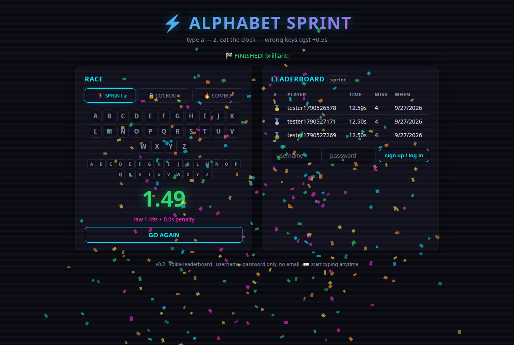
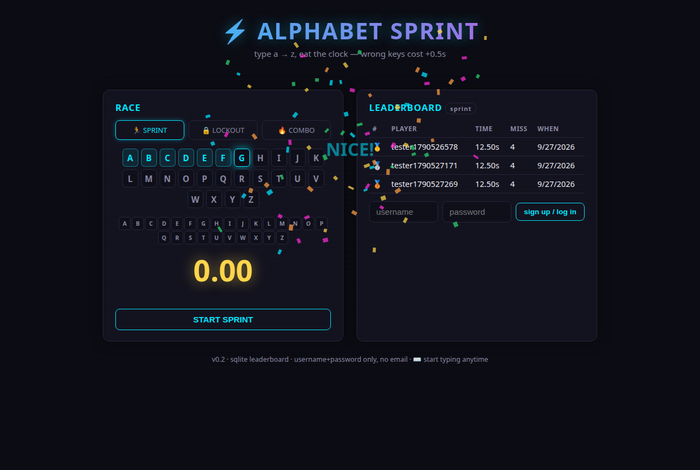

# ⚡ Alphabet Sprint

**Type a → z as fast as you can. Eat the clock.**

A tiny, loud, glowing keyboard race built for kids (ADHD-tested: every keypress fires a blip +
firework + pop in the *same frame*, no waiting ever) and competitive adults (SQLite leaderboard,
spoof-resistant scoring). No email, no accounts drama — username + password only.



## How it works

- Type `a` through `z` **in strict order**. Clock starts on your first `a`, stops on `z`.
- Wrong key = missed slot = **+0.5s penalty** (and it shows you exactly which letter you should have hit).
- Lower is better. Your best run per mode stands on the board.

| Mode | Rule | Vibe |
|------|------|------|
| 🏃 **Sprint** (default) | wrong key = +0.5s, keep going | chill speedrun |
| 🔒 **Lockout** | wrong key = back to `a`, clock keeps running | brutal, funny |
| 🔥 **Combo** | wrong key = streak resets | addictive chase |



## Juice (this matters)

- **Every correct key**: rising musical blip (a→z is a pitch staircase), letter pop, neon keycap flash, firework burst
- **Every 5 letters**: 🔥 streak badge + screen flash + confetti + cheer word
- **Finish line**: fanfare, confetti storm, giant glowing time, 🏁
- **Miss**: red keycap + shake + honest "+0.5s" — never a dead end, never a fail screen
- Timing uses **`event.timeStamp` / `performance.now()`** (never `Date.now()`), ignores OS key-repeat,
  so millisecond plateaus and misses are measured on real input events — not render frames.


## Run it

```bash
pip install fastapi uvicorn
uvicorn server:app --host 0.0.0.0 --port 8000
# open http://localhost:8000 — everything (game + API) on one port
```

Data lives in `~/.alphabet-sprint/` (SQLite DB + HMAC secret), deliberately **outside the web root**.

### Configuration

| Env var | Default | Meaning |
|---------|---------|---------|
| `ALLOWED_ORIGINS` | `*` | **Set to your real URL before hosting publicly** (e.g. `https://sprint.example.com`) |
| `AS_DATA_DIR` | `~/.alphabet-sprint` | where the DB and signing secret live |

## Fair play (honest section)

- Score = `raw + 0.5 × misses`, **and the server re-checks that math** — a submitted score whose
  numbers don't add up is rejected with a 400.
- A client-side game can still be scripted. It's a toy leaderboard; the integrity check filters the
  accidental cheats, and we're honest about the rest.
- One run per user counts on the board (your **best** run per mode, deduplicated server-side).

## Tech

- **Backend:** Python + FastAPI + SQLite. PBKDF2 (200k iterations) password hashing, HMAC-signed
  session tokens, in-process token-bucket rate limits, no external deps beyond FastAPI/uvicorn.
- **Frontend:** one self-contained `index.html`. Vanilla JS, canvas particles, Web Audio synth.
  No frameworks, no build step, no assets.
- **Privacy:** username + password only. No email. No PII. Passwords are never stored in plaintext
  (PBKDF2-SHA256, per-user salt).

## Roadmap (v2 stretch)

- [ ] **Daily seed** — everyone worldwide gets the same sequence; comparable daily times
- [ ] **Ghost replay** — translucent ghost of your PB races beside you
- [ ] Global board hardening (rate-limit tuning, moderation)

---

*Built with my kids as the primary playtesters. v0.2*
