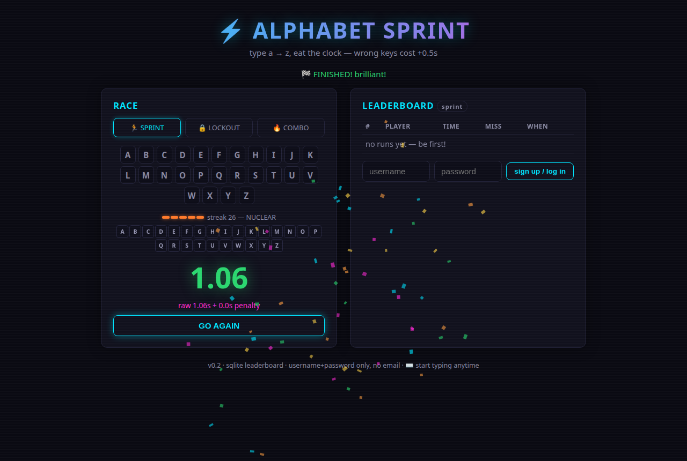
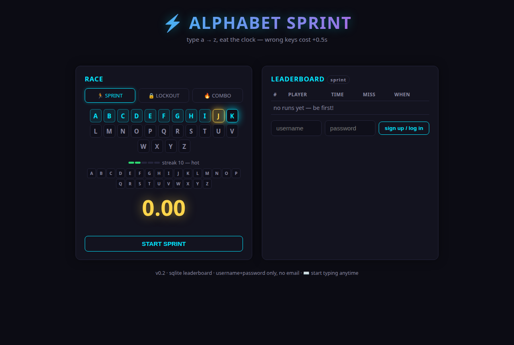
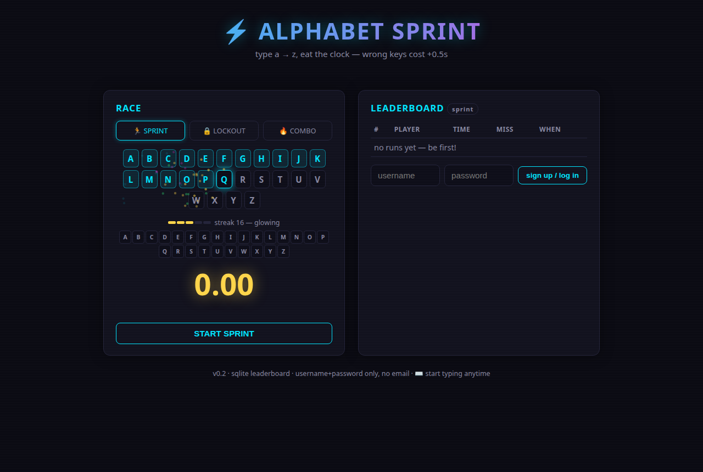
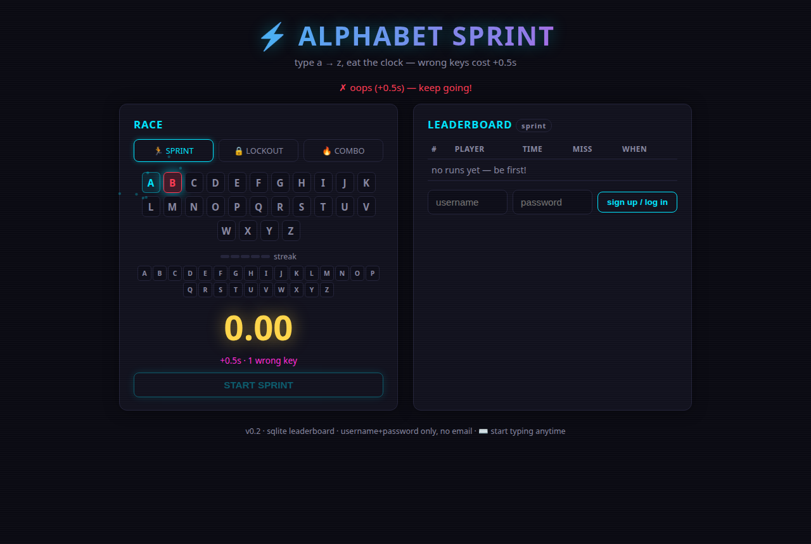

# ⚡ Alphabet Sprint

**Type a → z as fast as you can. Eat the clock.**

A tiny, loud, glowing keyboard race built for kids (ADHD-first: every keypress fires a blip +
pop + particle halo in the *same frame*) and competitive adults (SQLite leaderboard,
spoof-resistant scoring). No email, no accounts drama — username + password only.



## How it works

- Type `a` through `z` **in strict order**. Clock starts on your first `a`, stops on `z`.
- Wrong key = missed slot = **+0.5s penalty** (and it shows you exactly which letter you should have hit).
- Lower is better. Your **best run per mode** stands on the server-side leaderboard.

| Mode | Rule | Vibe |
|------|------|------|
| 🏃 **Sprint** (default) | wrong key = +0.5s, keep going | chill speedrun |
| 🔒 **Lockout** | wrong key = back to `a`, clock keeps running | brutal, funny |
| 🔥 **Combo** | wrong key = streak resets | addictive chase |

## Streak heat — the signature mechanic 🔥

Consecutive correct keys **physically warm the keyboard**. Every 5 clean keys, the whole
keycap row shifts one tier hotter — and one wrong key cools it instantly:

| Streak | Tier | Default — cyan | green | gold | magenta | **orange + blaze** |
|--------|------|-----|-------|------|---------|--------------------|
| | | 5 keys | 10 | 15 | 20 | 25+ — "NUCLEAR" |

The tiny heat meter above the keyboard counts your live streak with the tier name
(*warm → hot → glowing → blazing → NUCLEAR*), so accuracy becomes self-motivating:
kids **see** their streak catch fire and feel it evaporate when they slip — no lecture needed.



## Juice (this matters)

- **Every correct key, same frame**: rising musical blip (a→z is a pitch staircase), letter pop,
  neon keycap flash, particle burst **anchored at the key itself** (never a screen-wide explosion)
- **Every 5th key**: a subtle gold pulse beat at that key — the chunking rhythm mid-run, no confetti
- **Every 5 streak**: heat tier up (see above), `streak N — hot/glowing/blazing/NUCLEAR`
- **Finish line**: fanfare + one modest confetti burst + giant glowing time
- **Personal best**: a **second staggered confetti wave** — beating yourself *feels* bigger
- **Miss**: red keycap + shake + honest "+0.5s" — never a dead end, never a fail screen;
  wrong keys before you start are ignored, not penalized
- Timing uses **`event.timeStamp` / `performance.now()`** (never `Date.now()`), ignores OS
  key-repeat, so measurements come from real input events — not render frames




## Run it

```bash
pip install fastapi uvicorn
uvicorn server:app --host 0.0.0.0 --port 8000
# open http://localhost:8000 — game + API on one port; LAN players use the host's IP
```

Data lives in `~/.alphabet-sprint/` (SQLite DB + HMAC secret), deliberately **outside the web root**.

### Configuration

| Env var | Default | Meaning |
|---------|---------|---------|
| `ALLOWED_ORIGINS` | `*` | **Set to your real URL before hosting publicly** (e.g. `https://sprint.example.com`) |
| `AS_DATA_DIR` | `~/.alphabet-sprint` | where the DB and signing secret live |

## Fair play (honest section)

- Score = `raw + 0.5 × misses`, **and the server re-checks that math** — a submitted score whose
  numbers don't add up is rejected with a 400.
- A client-side game can still be scripted. It's a toy leaderboard; the integrity check filters the
  accidental cheats, and we're honest about the rest.
- One row per user on the board (your best run per mode, deduplicated server-side).
- Rate limits: 5 register/min, 10 login/min, 30 scores/min per IP (token bucket).

## Tech

- **Backend:** Python + FastAPI + SQLite. PBKDF2 (200k iterations) password hashing, HMAC-signed
  session tokens, no external deps beyond FastAPI/uvicorn.
- **Frontend:** one self-contained `index.html`. Vanilla JS, canvas particles, Web Audio synth.
  No frameworks, no build step, no assets.
- **Privacy:** username + password only. No email. No PII. Passwords are never stored in plaintext
  (PBKDF2-SHA256, per-user salt).

## Roadmap (v0.4 stretch)

- [ ] **Daily seed** — everyone gets the same sequence; comparable daily times
- [ ] **Ghost replay** — translucent ghost of your PB races beside you
- [ ] Escalating back-half intensity (pulse/comet trail speed up past letter N)

---

*Built with my kids as the primary playtesters. v0.3*
